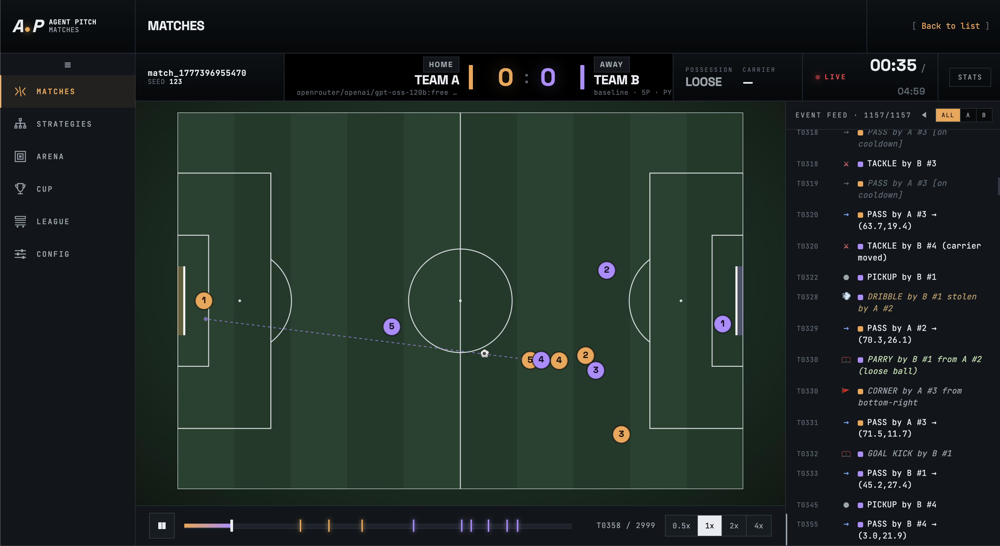

# AgentPitch

[](https://github.com/gangtao/AgentPitch/actions/workflows/ci.yml)
[](https://github.com/gangtao/AgentPitch/actions/workflows/release.yml)
[](https://github.com/gangtao/AgentPitch/pkgs/container/agentpitch)
[](https://www.python.org/)


An LLM-powered soccer simulation where every player on the field is an AI agent. Each player's decision logic is generated by a large language model and evolves between matches based on prior performance.



## Documentation

| Doc | Description |
|-----|-------------|
| [Design & Architecture](docs/design.md) | System layers, data flow, sandbox internals, and key design decisions |
| [Matches](docs/matches.md) | Running and replaying individual matches |
| [Strategies](docs/strategies.md) | Creating, editing, and managing player strategies |
| [Arena](docs/arena.md) | Head-to-head match with strategy evolution |
| [Cup](docs/cup.md) | Single-elimination tournament setup and bracket view |
| [League](docs/league.md) | Round-robin league setup, matchdays, and standings |
| [Config](docs/config.md) | Match configuration, field settings, and LLM providers |

## How it works

Each player runs a `decide(game_state, player_state, history)` callback that you or an LLM writes in Python, JavaScript, or Rust. Before every match the Code Generation Pipeline asks an LLM to produce a strategy; after the match the Post-Match Evolution Pipeline feeds the match log back to the LLM so strategies improve over time. All generated code executes inside language-specific sandboxes — no arbitrary host access.

```
Config (YAML/API)
  → Code Generation Pipeline  (LLM writes decide() code)
  → Sandbox                   (compile + cache the callback)
  → Tick Engine               (runs ticks until match ends)
      each tick: build snapshot → Sandbox.execute() → Action
               → ActionResolutionEngine
               → PlayerMovementSystem / BallPhysicsSystem
               → MatchLog records tick
  → Post-Match Evolution Pipeline  (LLM evolves strategy from match log)
```

## Requirements

- Python 3.11+
- API key for at least one supported LLM provider (OpenAI, Anthropic, Gemini, DeepSeek, OpenRouter, or a local Ollama instance)

## Installation

```bash
# Install with all sandbox backends (JS via QuickJS, WASM via Wasmtime)
make install          # pip install -e '.[all]'

# Python-only (no JS or Rust strategies)
pip install -e .
```

## Quickstart

```bash
# 1. Install
make install

# 2. Start the browser UI on http://localhost:8765
make serve
```

Open `http://localhost:8765` in your browser. Go to **Config → Providers**, select your LLM provider, and enter your API key. The key is stored locally in `data/.secrets.json` and never leaves your machine.

Supported providers: OpenAI, Anthropic, Gemini, DeepSeek, OpenRouter, or a local Ollama instance (no key required).

## CLI commands

| Command | Description |
|---------|-------------|
| `agent-pitch serve` | Start the FastAPI server + browser UI (port 8765) |
| `agent-pitch run` | Execute a season of matches |
| `agent-pitch generate-strategy` | Generate one strategy via LLM |
| `agent-pitch cup-run` | Run a cup tournament |
| `agent-pitch league-run` | Run a league tournament |

## Make targets

```bash
make install              # install locally with all sandboxes
make test                 # run the test suite
make test-cov             # run tests with coverage (≥80% required)
make serve                # start server on port 8765

make docker-build         # build via docker compose
make docker-up            # run via docker compose (port 8765)
make docker-down          # stop compose container
make docker-image         # build standalone image agent-pitch:latest
make docker-run           # run standalone image with ./data volume mapped
```

## Match Viewer (standalone)

`tools/match-viewer.html` is a self-contained HTML file that replays any saved match with no server required. Open it directly in a browser.

**Folder picker mode** — select a match directory (contains `meta.json` + `events.jsonl`):

```
Open tools/match-viewer.html → click "Select Match Folder" → pick data/matches/<match_id>/
```

**Bundled mode** — embed match data into a shareable single-file HTML:

```bash
python tools/bundle_match.py data/matches/<match_id>
# → tools/match-viewer-bundled-<match_id>.html  (opens with no loader, ~11 MB)
```

The bundled file has no external dependencies beyond Google Fonts (degrades gracefully offline).

## Supported LLM providers

Edit `data/llm-providers.yaml` to select your provider and model:

| Provider | Notes |
|----------|-------|
| OpenAI | `OPENAI_API_KEY` |
| Anthropic | `ANTHROPIC_API_KEY` |
| Gemini | `GEMINI_API_KEY` |
| DeepSeek | OpenAI-compatible, `DEEPSEEK_API_KEY` |
| OpenRouter | OpenAI-compatible, `OPENROUTER_API_KEY` |
| Ollama | Local, no key required |

## Strategy languages

| Extension | Sandbox | Extra dependency |
|-----------|---------|-----------------|
| `.py` | RestrictedPython | always available |
| `.js` | QuickJS | `pip install -e '.[js]'` |
| `.rs` | Wasmtime (compiles Rust → WASM) | `pip install -e '.[wasm]'` |


## Docker

```bash
# Build and run with docker compose
make docker-build && make docker-up

# Or build and run a standalone image
make docker-image && make docker-run
```

The container maps `./data` as a volume so strategies and configuration persist between runs.

## Contributing

See [CONTRIBUTING.md](CONTRIBUTING.md) for setup, testing, and pull request guidelines.

## License

Apache 2.0 — see [LICENSE](LICENSE).
