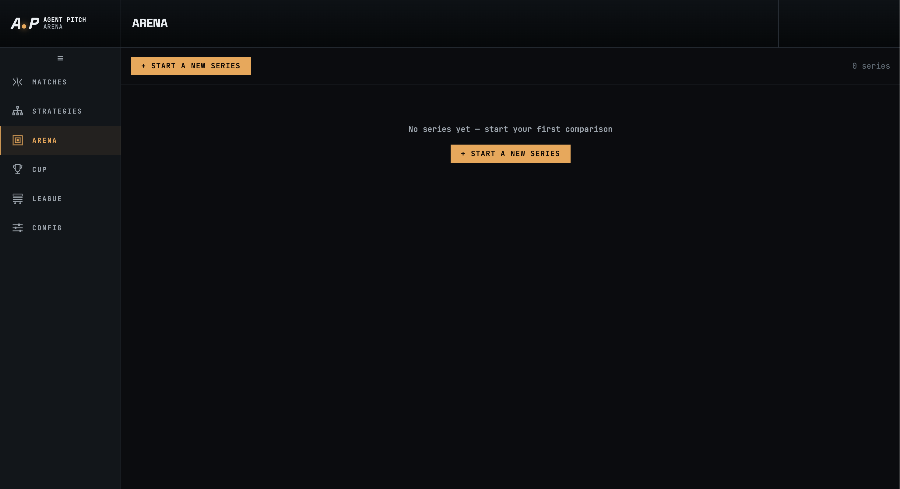
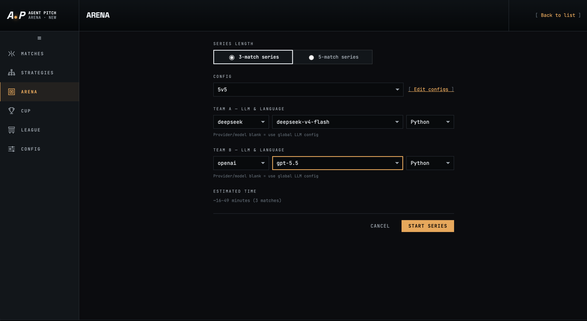
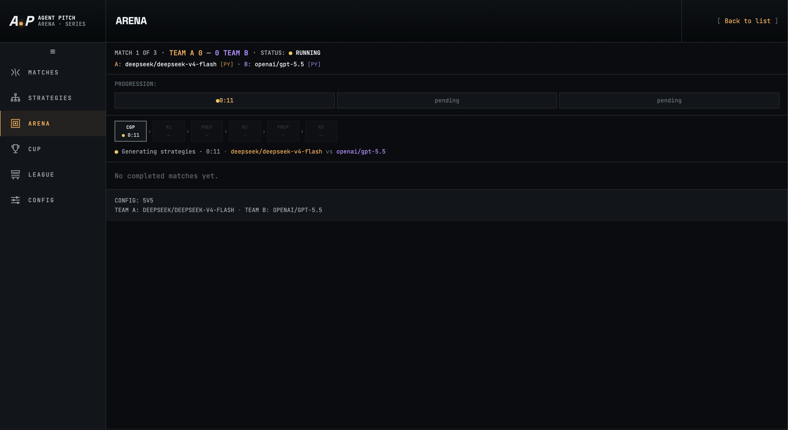
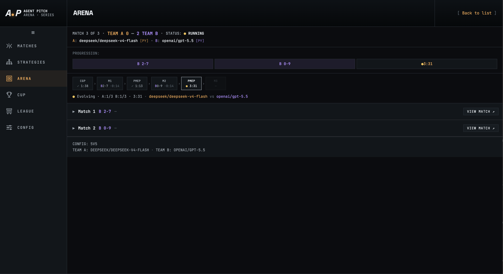
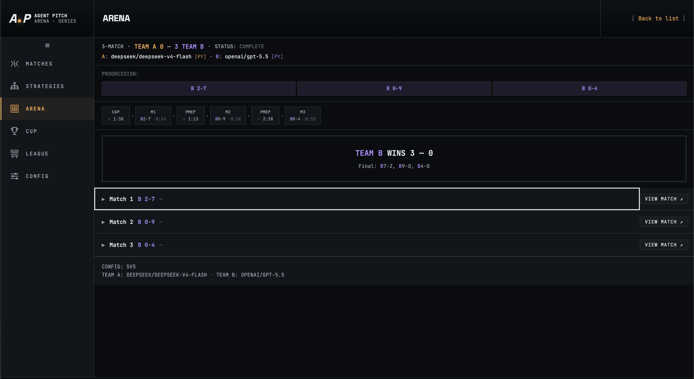

# Arena

The **Arena** is the head-to-head comparison mode. Instead of a single match, you run a **series** of 3 or 5 matches between two LLM-powered teams. After each match the Post-Match Evolution Pipeline (PMEP) automatically rewrites both teams' strategies based on what just happened — so each game is played by an improved version of the previous strategy. This makes Arena the primary tool for benchmarking LLM providers and models against each other.

Navigate to Arena from the left sidebar.

---

## Series list



When no series have been run the page shows **No series yet — start your first comparison**. After series are completed they appear here as a history list sorted by start time. Each entry shows the series ID, format (3-match or 5-match), config, status, and the final score. Click **+ Start a New Series** to configure a new one.

---

## Starting a series



Fill in the setup form and click **Start Series**.

| Field | Description |
|-------|-------------|
| **Series Length** | **3-match series** or **5-match series**. The team that wins more matches wins the series. |
| **Config** | The match configuration applied to every match in the series (field size, duration, team rosters). Click **Edit configs** to jump to the Config section. |
| **Team A — LLM & Language** | Provider, model, and strategy language for Team A. The LLM generates and evolves Team A's strategy between matches. Leave provider/model blank to use the global LLM config from the Config → LLM tab. |
| **Team B — LLM & Language** | Same options for Team B. Each team can use a different provider, model, and language — this is the core of the head-to-head comparison. |
| **Estimated Time** | A rough duration estimate based on series length and typical LLM generation times (e.g. `~16–49 minutes (3 matches)`). |

**Supported languages** for each team: Python, JavaScript, Rust.

Leaving a provider or model blank inherits from the global LLM configuration. Setting different providers per team (e.g. `deepseek` vs `openai`) directly compares which LLM writes better soccer strategy.

---

## Series in progress — match 1



Once started, the series view shows live progress.

### Header

The top bar shows the current match number, the running series score (Team A wins — Team B wins), and the status badge (**RUNNING** in amber while active).

Below it: the strategy identifiers for each team, showing provider, model, and language badge (e.g. `A: deepseek/deepseek-v4-flash [PY]  ·  B: openai/gpt-5.5 [PY]`).

### Progression timeline

The progression bar is a pipeline diagram showing every stage of the series:

| Stage | Description |
|-------|-------------|
| **CGP** | Code Generation Pipeline — the LLM writes the initial strategy before the first match. |
| **M1, M2, M3…** | Each match. Shows elapsed time when running, final score when complete. |
| **PREP** | Preparation between matches — PMEP evolves both strategies using the previous match log before the next match starts. |

The active stage pulses with a live indicator and elapsed time. Pending stages show `—`. Completed stages show the result score.

### Activity log

Below the timeline a live log line describes what the engine is currently doing, for example:

```
● Generating strategies · 0:11 · deepseek/deepseek-v4-flash vs openai/gpt-5.5
```

### Match results

As matches complete they appear as expandable rows below the log. Before any match finishes the area shows **No completed matches yet.**

The config summary at the bottom confirms which config and strategies are active for this series.

---

## Series in progress — later matches



As the series progresses the progression bar fills in from left to right. Completed matches show their final scores (e.g. `B 2-7`, `B 0-9`) and the series score accumulates in the header (e.g. `Team A 2 — Team B`).

Each completed match appears as a collapsible row showing the result and a **View Match →** button. Clicking it opens the full match live view and statistics for that individual match (see [Matches](matches.md)).

The active PREP stage shows the elapsed evolution time while the LLM rewrites strategies. The next match starts automatically when preparation completes.

---

## Completed series



When all matches have been played the series status changes to **COMPLETE** and a result banner appears:

```
TEAM B WINS 3 — 0
Final: B7-2, B9-0, B4-0
```

The banner shows the winning team, the series score, and each individual match result. All three (or five) matches are listed with **View Match →** links for detailed replay and statistics.

If neither team wins a majority (only possible in a 3-match series with 1 win each and 1 tie, or a 5-match series that ends 2-2-1) the status shows as **TIED**.

---

## How strategy evolution works

At the start of a series both teams have no prior strategy. The Code Generation Pipeline (CGP) calls the assigned LLM and asks it to write a `decide()` function from scratch, guided by the full API contract and field schema.

After each match the Post-Match Evolution Pipeline (PMEP) reads the match log and asks the same LLM to improve the strategy:

1. **CGP** — LLM writes `strategy_v1` for each team before match 1.
2. **Match 1** plays.
3. **PMEP** — each team's LLM reviews the match log and writes `strategy_v2`.
4. **Match 2** plays with the evolved strategies.
5. This repeats until all matches are complete.

Each version of the strategy is archived under the series directory so you can trace exactly how each team's play style changed across the series.

---

## Series output files

Each series is saved under `data/arena/series_<series-id>/`:

| Path | Contents |
|------|----------|
| `series.json` | Series metadata: format, status, config, start/end timestamps, per-match results, running series score. |
| `events.jsonl` | Lifecycle events streamed to the UI during the series (strategy generation, match start/end, errors). |
| `strategies/team_a/strategy_v1.py` … | Versioned strategy files for Team A, one per match. |
| `strategies/team_b/strategy_v1.py` … | Versioned strategy files for Team B, one per match. |

Individual match logs (tick data, per-match stats) are stored separately under `data/logs/<match-id>/` as for any other match.
