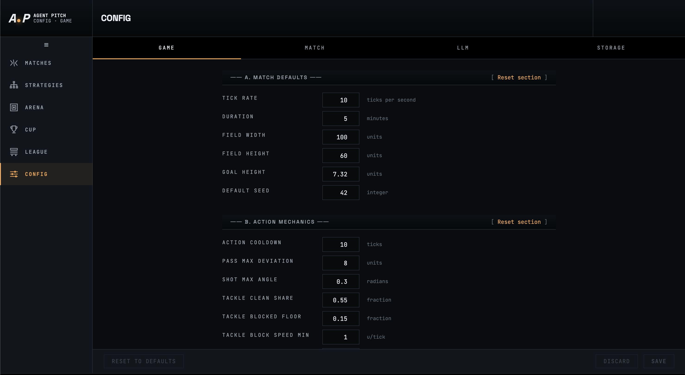
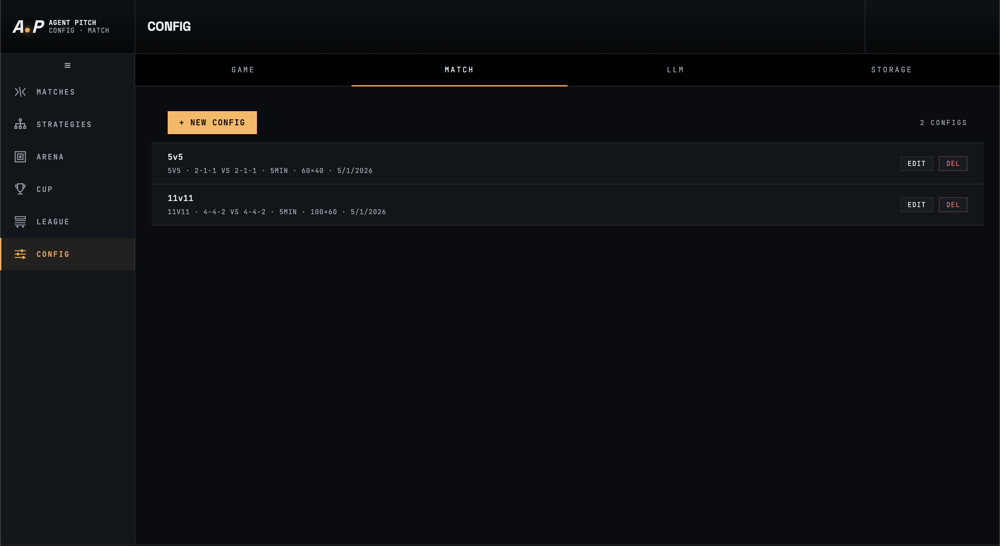
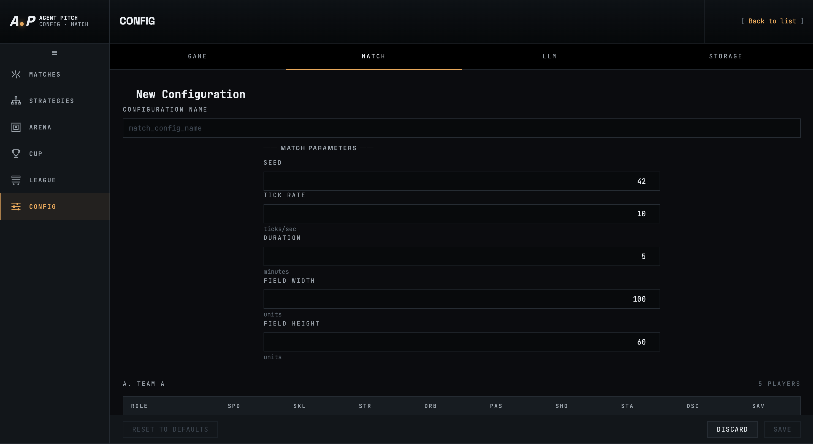
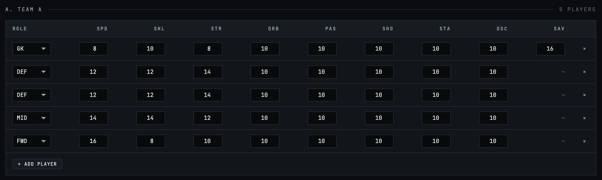
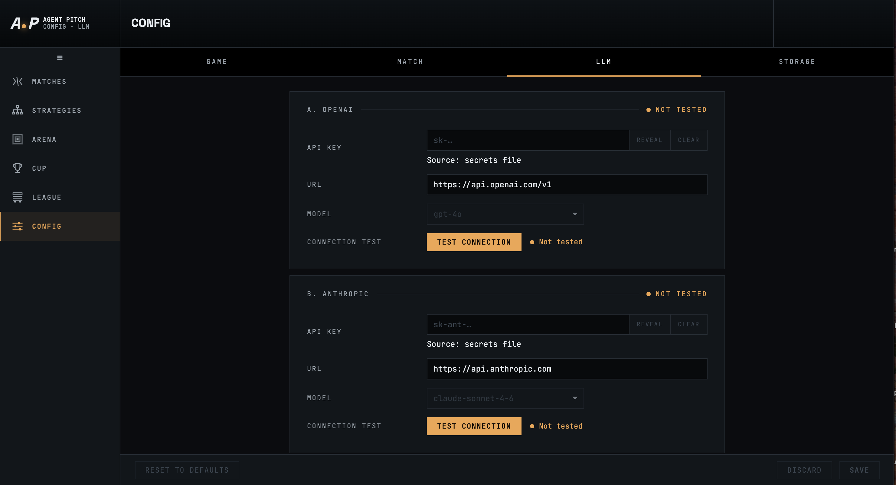
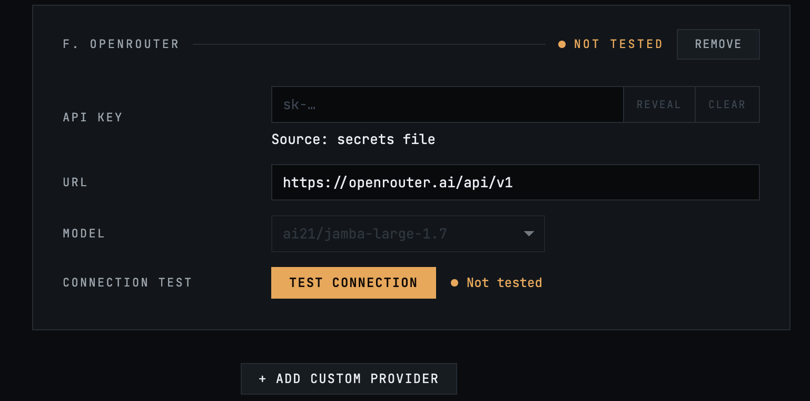

# Config

The **Config** section is the central control panel for AgentPitch. It is divided into four tabs — **Game**, **Match**, **LLM**, and **Storage** — each governing a distinct aspect of the simulation.

Navigate to Config from the left sidebar at any time. Changes take effect on the next match start unless otherwise noted. Every tab has **Discard** and **Save** buttons; use **Reset to Defaults** to restore factory values.

---

## Game tab

The Game tab controls global simulation physics and timing constants that apply to every match. These values are loaded from `data/global-defaults.yaml` and saved back there on **Save**.

### A. Match defaults

| Field | Default | Unit | Description |
|-------|---------|------|-------------|
| Tick Rate | `10` | ticks/sec | How many simulation steps run per real second. Higher values increase physics fidelity at the cost of CPU. |
| Duration | `5` | minutes | Length of a match (full 90 minutes = two halves of 45). |
| Field Width | `100` | units | Horizontal span of the pitch. |
| Field Height | `60` | units | Vertical span of the pitch. |
| Goal Height | `7.32` | units | Width of the goal mouth (standard real-world ratio). |
| Default Seed | `42` | integer | Random seed used when a match config does not specify one, ensuring reproducible results. |

### B. Action mechanics

These knobs govern how player actions resolve during each tick.

| Field | Default | Unit | Description |
|-------|---------|------|-------------|
| Action Cooldown | `10` | ticks | Minimum ticks between successive actions per player (1 second at the default tick rate). |
| Pass Max Deviation | `8` | units | Maximum positional error added to a pass at skill = 1. Error scales down as skill rises. |
| Shot Max Angle | `0.3` | radians | Maximum angular deviation for a shot at minimum skill. |
| Tackle Clean Share | `0.55` | fraction | Probability that a successful tackle cleanly wins the ball (vs. a loose deflection). |
| Tackle Blocked Floor | `0.15` | fraction | Minimum deflection probability even on a failed tackle. |
| Tackle Block Speed Min | `1` | u/tick | Minimum speed of a deflected ball after a blocked tackle. |

The Game tab also exposes additional sections (C–F) for goalkeeper physics, stamina, match-flow timing, and formation snap — all scrollable below the visible area.

### C. Goalkeeper / ball physics

Controls how the goalkeeper interacts with shots and how the ball behaves on deflections.

| Field | Default | Description |
|-------|---------|-------------|
| GK Caught Share | `0.60` | Fraction of saves resulting in a clean catch (vs. a parry). |
| GK Block Speed Factor | `0.40` | Speed multiplier applied to the ball on a parried save. |
| Ball Control Range GK | `1.5` | Radius within which the GK can claim the ball. |
| Ball Control Range Outfield | `1.0` | Radius within which outfield players can claim the ball. |

### D. Stamina / health

| Field | Default | Description |
|-------|---------|-------------|
| Health Max | `100` | Maximum health/stamina for each player. |
| Health Drain Factor | `1.0` | Global multiplier on health drain per tick. Increase to make matches more physically demanding. |
| Health Floor | `0.6` | Minimum effectiveness multiplier when a player is exhausted (60% at zero stamina). |

### E. Match-flow timing

| Field | Default | Unit | Description |
|-------|---------|------|-------------|
| Goal Reset Ticks | `30` | ticks | Pause after a goal before kick-off resumes. |
| Half-time Pause Ticks | `60` | ticks | Pause at half-time before the second half begins. |
| Min Player Separation | `1.0` | units | Minimum enforced distance between players to prevent overlap. |

### F. Formation system

| Field | Default | Description |
|-------|---------|-------------|
| Formation Snap | `off` | When enabled, the engine nudges each player toward their dynamic phase-aware formation anchor each tick. Off by default — strategies fully own positioning. Turn on for a system-assisted helper. |

---

## Match tab

The Match tab manages named match configurations. Each configuration is a reusable preset that defines team composition and per-match physics overrides. Configurations are stored as YAML files under `data/configs/`.

Two built-in configurations ship out of the box:

| Name | Format | Duration | Field |
|------|--------|----------|-------|
| `5v5` | 2-1-1 vs 2-1-1 | 5 min | 60 × 40 |
| `11v11` | 4-4-2 vs 4-4-2 | 5 min | 100 × 60 |

Click **+ New Config** to create a new one, or **Edit** to modify an existing one.

### Creating / editing a match config

Give the configuration a unique **Configuration Name**. Then set the match parameters:

| Field | Description |
|-------|-------------|
| Seed | Random seed for this specific config (overrides the global default). |
| Tick Rate | Ticks per second for this match. |
| Duration | Match length in minutes. |
| Field Width | Pitch width in game units. |
| Field Height | Pitch height in game units. |

### Player attributes

Below the match parameters, each team is configured as a roster of players. Use **+ Add Player** to grow the squad (5–11 players per team) and the × button to remove a row.

Each player row has:

| Column | Range | Description |
|--------|-------|-------------|
| Role | GK / DEF / MID / FWD | Position on the pitch. Only one GK is expected per team. |
| SPD (Speed) | 1–20 | Movement speed per tick. |
| SKL (Skill) | 1–20 | Reduces error on passes and shots. |
| STR (Strength) | 1–20 | Tackle success rate and physical duels. |
| DRB (Dribbling) | 1–20 | Ball retention while moving. |
| PAS (Passing) | 1–20 | Pass accuracy. |
| SHO (Shooting) | 1–20 | Shot power and accuracy. |
| STA (Stamina) | 1–20 | Rate of health drain during the match. |
| DSC (Discipline) | 1–20 | Reduces chance of conceding fouls. |
| SAV (Save) | 1–20 | Goalkeeper-only. Save success probability. |

Attributes default to `10`. The SAV column is only active for the GK role; outfield players show `—`.

Click **Save** to write the configuration to disk. Click **Back to list** (top-right) to return without saving.

---

## LLM tab

The LLM tab configures the AI providers that generate and evolve player strategies. Each provider panel exposes:

| Field | Description |
|-------|-------------|
| API Key | Secret key for authentication. Stored in the secrets file, never in YAML. Use **Reveal** to view, **Clear** to remove. |
| URL | Base endpoint for the provider's API. |
| Model | Which model to use for code generation (selected from a dropdown of known models). |
| Connection Test | Validates the key and endpoint with a live API call. Status shows **OK** (green), **Not tested** (amber), or an error. |

Built-in providers configured out of the box:

| Provider | Default Model | Endpoint |
|----------|--------------|----------|
| OpenAI | `gpt-4o` | `https://api.openai.com/v1` |
| Anthropic | `claude-sonnet-4-6` | `https://api.anthropic.com` |
| Gemini | `gemini-2.0-flash` | `https://generativelanguage.googleapis.com` |
| DeepSeek | `deepseek-v4-flash` | `https://api.deepseek.com` |
| OpenRouter | `ai21/jamba-large-1.7` | `https://openrouter.ai/api/v1` |
| Ollama | `qwen2.5-coder:7b` | `http://localhost:11434/v1/` (local) |

### Custom providers

Click **+ Add Custom Provider** at the bottom of the LLM tab to add any OpenAI-compatible endpoint (e.g. vLLM, LM Studio, Azure OpenAI). Custom providers have the same fields as built-in ones and include a **Remove** button to delete them.

API keys are resolved in this priority order: UI field → environment variable → secrets file.

---

## Storage tab

The Storage tab sets the **data home** directory — the root folder where AgentPitch persists strategies, match configs, logs, and provider settings.

| Field | Default | Description |
|-------|---------|-------------|
| Data Home | `./data` | Absolute or `~`-relative path to the data directory. The path must exist and be writable, or its parent must be writable so AgentPitch can create it. Paths with `..` components are rejected. |

Changes to Data Home take effect after the next server restart.
