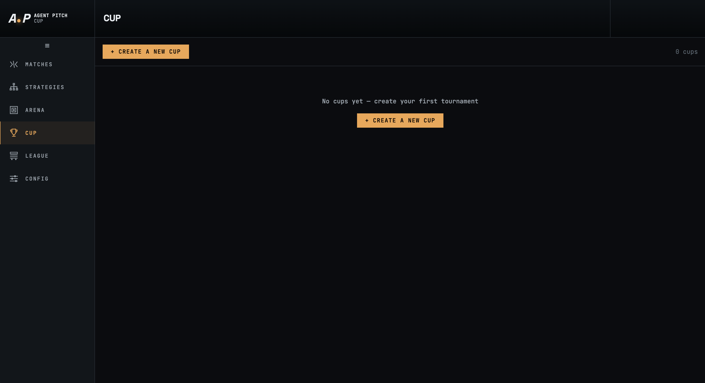
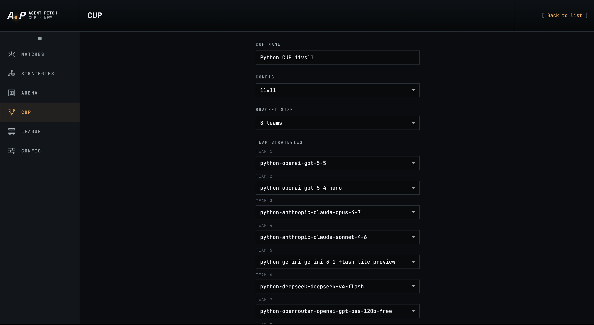
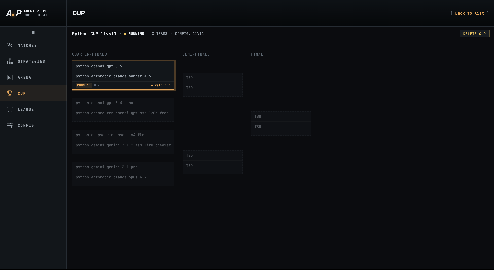
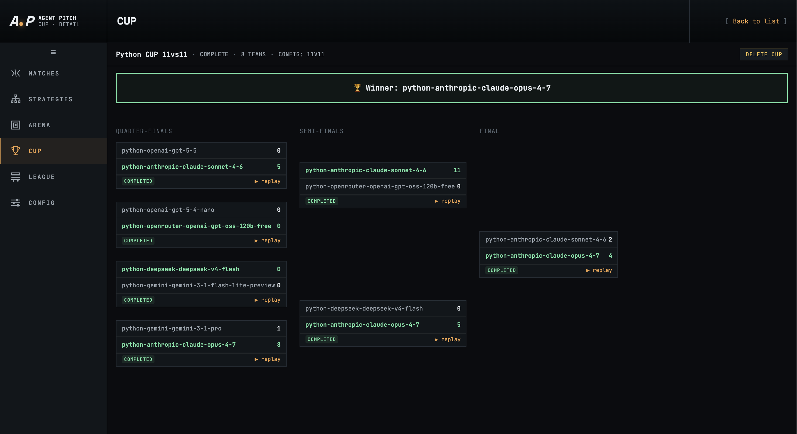

# Cup

The **Cup** is a single-elimination tournament where multiple strategies compete head-to-head through a bracket. Teams are seeded into Quarter-Finals, Semi-Finals, and a Final (or earlier rounds for larger brackets), and the winner of each match advances until one strategy is crowned champion.

Navigate to Cup from the left sidebar.

---

## Cup list



When no cups have been run the page shows **No cups yet — create your first tournament**. Completed and in-progress cups appear here as a history list. Click **+ Create a New Cup** to set one up.

---

## Creating a cup



Fill in the setup form and click **Start Cup** (scroll down past the team list to find it).

| Field | Description |
|-------|-------------|
| **Cup Name** | A display name for the tournament, e.g. `Python CUP 11vs11`. Up to 64 characters. |
| **Config** | The match configuration applied to every match in the bracket (field size, duration, team rosters). |
| **Bracket Size** | Number of competing teams: **4**, **8**, **16**, or **32**. Determines how many rounds the bracket has. |
| **Team Strategies** | One strategy per team slot. Each dropdown shows all strategies in your library. Every slot must be filled before the cup can start. |

### Bracket sizes and rounds

| Bracket Size | Rounds |
|-------------|--------|
| 4 teams | Semi-Finals → Final |
| 8 teams | Quarter-Finals → Semi-Finals → Final |
| 16 teams | Round of 16 → Quarter-Finals → Semi-Finals → Final |
| 32 teams | Round of 32 → Round of 16 → Quarter-Finals → Semi-Finals → Final |

Strategy names in the team slots follow the pattern `<language>-<provider>-<model>`, making it easy to see at a glance which LLM and language each competitor represents (e.g. `python-openai-gpt-5-5`, `python-anthropic-claude-opus-4-7`).

---

## Cup in progress



Once started, the cup view displays a live bracket drawn left-to-right from the earliest round to the Final.

### Cup header

The top bar shows the cup name, status badge (**RUNNING** in amber), bracket size, and config name. A **Delete Cup** button is available top-right to remove the cup and its data.

### Bracket view

Each column is a round (Quarter-Finals, Semi-Finals, Final). Each match card shows the two competing strategies. The active match is highlighted with a **RUNNING** badge and an elapsed time counter, and is tagged **watching** to indicate it is currently being played.

Matches that have not yet been scheduled show **TBD** in the slot — their participants will be filled in as earlier rounds complete.

When a match finishes the winner's strategy name is carried forward into the next round's slot automatically.

---

## Completed cup



When the Final has been played the status changes to **COMPLETE** and a winner banner appears at the top of the bracket:

```
🏆  Winner: python-anthropic-claude-opus-4-7
```

Every match card shows its final score and a **► replay** button. Clicking replay opens the full match live view and statistics for that individual match (see [Matches](matches.md)).

Match cards are colour-coded by result:

| Colour | Meaning |
|--------|---------|
| Highlighted row | The winning strategy in that match. |
| Score shown | Final goals for each side (e.g. `11` vs `0`). |
| **COMPLETED** badge | Match is finished. |

The bracket remains fully navigable after completion — you can replay any match from any round.

---

## Cup output files

Each cup is saved under `data/cups/cup_<cup-id>/`:

| Path | Contents |
|------|----------|
| `cup.json` | Tournament metadata: name, bracket size, config, status, created/completed timestamps, winner, team slots, and the full rounds/matches structure with results and scores. |
| `matches/<match-id>/` | Standard match output directory for each individual match played (tick log, stats, strategy snapshots — same layout as a standalone match). |
