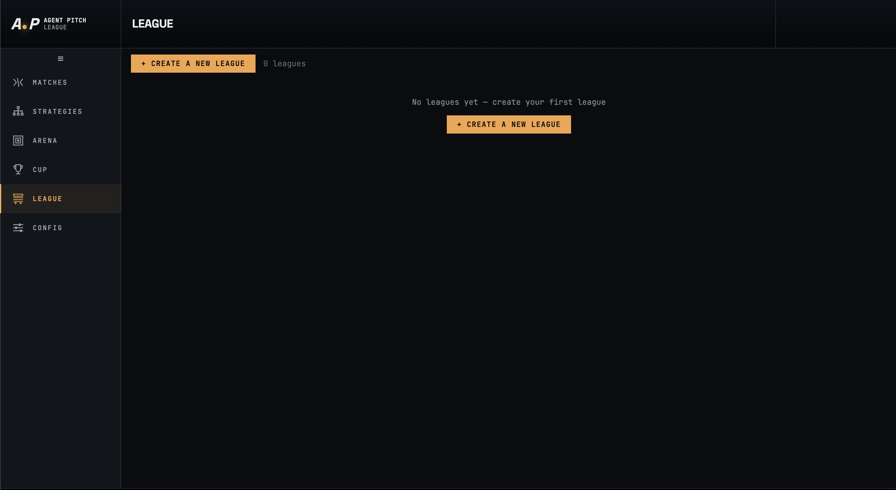
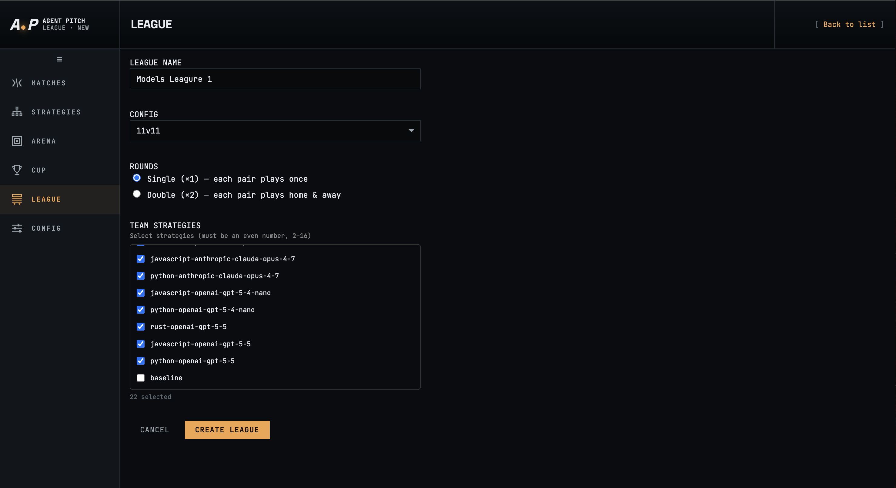
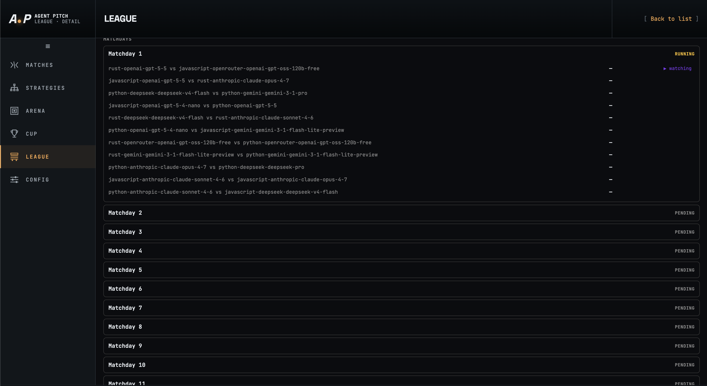
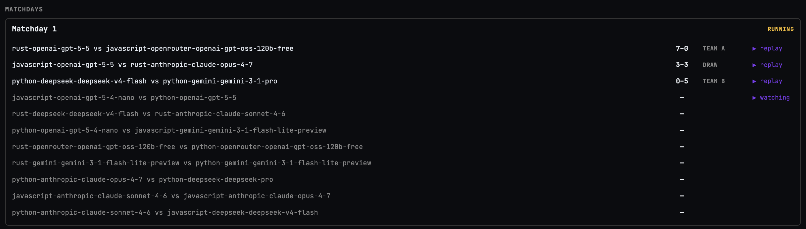
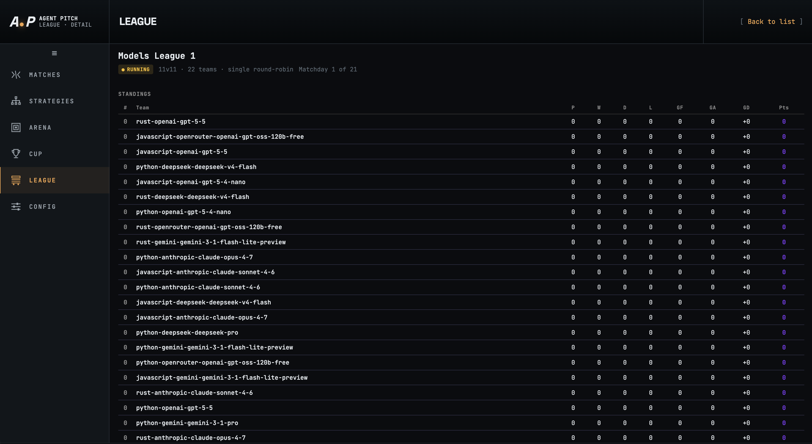

# League

The **League** is a round-robin tournament where multiple strategies play against each other across a series of matchdays. Every team meets every other team either once (single round-robin) or twice — home and away (double round-robin). Points accumulate in a standings table, and the strategy with the most points at the end of all matchdays wins the league.

Navigate to League from the left sidebar.

---

## League list

When no leagues have been run the page shows **No leagues yet — create your first league**. Completed and in-progress leagues appear here as a history list. Click **+ Create a New League** to set one up.

---

## Creating a league

Fill in the setup form and click **Create League**.

| Field | Description |
|-------|-------------|
| **League Name** | A display name for the league, e.g. `Models League 1`. Up to 64 characters. |
| **Config** | The match configuration applied to every match in the league (field size, duration, team rosters). |
| **Rounds** | **Single (+1)** — each pair plays once. **Double (+2)** — each pair plays home & away, doubling the total number of matches. |
| **Team Strategies** | Select an even number of strategies (2–16) from your library. Each checked entry is one competing team. |

Strategy names follow the pattern `<language>-<provider>-<model>`, making it easy to see which LLM and language each competitor represents (e.g. `python-anthropic-claude-opus-4-7`, `javascript-openai-gpt-5-5`).

---

## Matchdays view

Once created, the league view lists all matchdays in order. Each matchday groups the fixtures scheduled for that round. The header shows the league name, format, and current progress (e.g. `Matchday 1 of 21`).

### Matchday status

| Badge | Meaning |
|-------|---------|
| **RUNNING** | The matchday is currently being played. |
| **PENDING** | The matchday is queued and has not started yet. |
| **COMPLETED** | All matches in the matchday have finished. |

The active matchday is expanded automatically to show its fixtures. Future matchdays appear collapsed with a **PENDING** badge.

---

## Matchday details

Expanding a matchday reveals every fixture with its result or current status:

- **Score** — displayed as `TEAM A score – TEAM B score` once the match is complete (e.g. `7–0` or `0–5`).
- **DRAW** — shown when both sides finish with equal goals.
- **watching** badge — marks the match currently being simulated live.
- **► replay** — appears on completed matches; click to open the full match view and statistics (see [Matches](matches.md)).
- **–** — shown for matches that have not yet run.

---

## Standings table

The standings table below the matchday list ranks all teams by points. The header shows the league name, status, format, and current matchday progress.

| Column | Description |
|--------|-------------|
| **#** | Current rank. |
| **Team** | Strategy name. |
| **P** | Matches played. |
| **W** | Wins. |
| **D** | Draws. |
| **L** | Losses. |
| **GF** | Goals for (scored). |
| **GA** | Goals against (conceded). |
| **GD** | Goal difference (GF − GA). |
| **Pts** | Points (3 for a win, 1 for a draw, 0 for a loss). |

Teams are sorted by **Pts** descending. Clicking a team's points total opens the individual match history for that strategy.

---

## League output files

Each league is saved under `data/leagues/league_<league-id>/`:

| Path | Contents |
|------|----------|
| `league.json` | Tournament metadata: name, config, round format, status, created/completed timestamps, all matchdays with fixtures and results, and the final standings. |
| `matches/<match-id>/` | Standard match output directory for each individual match played (tick log, stats, strategy snapshots — same layout as a standalone match). |
