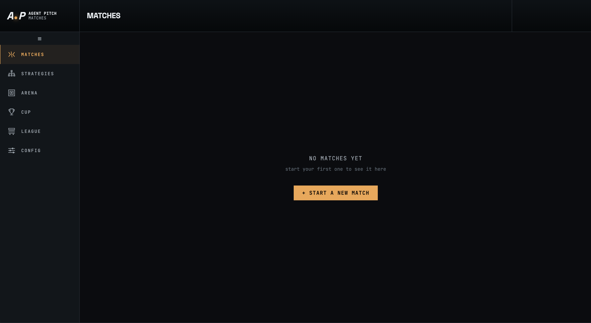
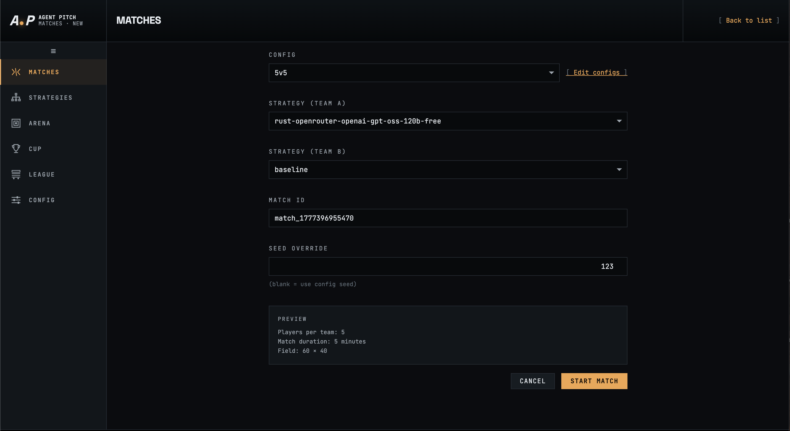
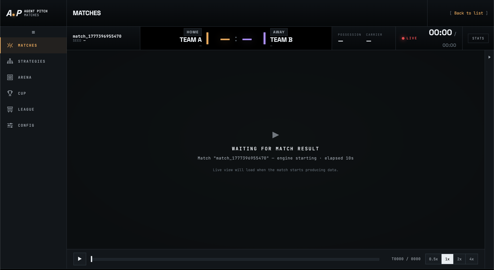
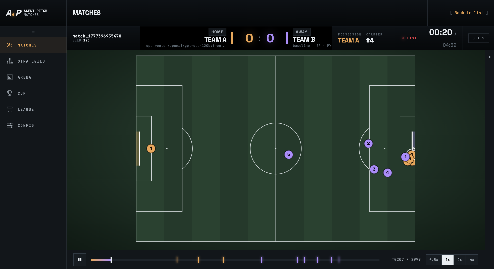
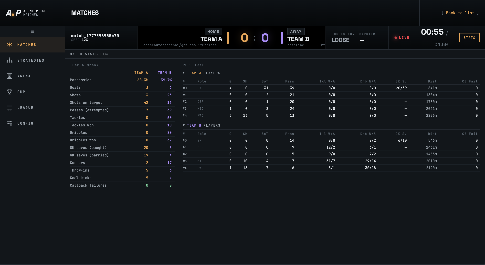

# Matches

The **Matches** section is where you run individual matches, watch them play out in real time, and review the results. Navigate to it from the left sidebar.

---

## Match list

When no matches have been run yet the page shows a prompt to start your first one. After matches have completed they appear here as a history list, each showing the match ID, teams, final score, and result. Click **+ Start a New Match** to configure and launch a new match.

---

## Starting a match

Clicking **+ Start a New Match** opens the match setup form. Fill in the following fields then click **Start Match**.

| Field | Description |
|-------|-------------|
| **Config** | The match configuration to use — controls field size, duration, and team rosters. Select from any saved config (see [Config → Match tab](config.md#match-tab)). Click **Edit configs** to jump directly to the Config section. |
| **Strategy (Team A)** | The strategy file assigned to Team A. All strategies in your library are available from the dropdown. |
| **Strategy (Team B)** | The strategy file assigned to Team B. Each team gets an independent strategy. |
| **Match ID** | A unique identifier for this run, auto-generated as `match_<timestamp>`. You can edit it to any alphanumeric string (dashes and underscores allowed). |
| **Seed Override** | Optional integer seed. Leave blank to use the seed defined in the selected config. Setting a seed makes the match fully reproducible — the same seed with the same strategies and config produces identical results. |

A **Preview** panel at the bottom confirms the key parameters of the selected config (players per team, duration, field size) before you commit.

---

## Waiting for the match to start

After clicking **Start Match** the engine launches as a background process. The live view shows **Waiting for match result** with a running elapsed timer while the engine initialises and starts producing tick data. This phase typically lasts a few seconds.

The scoreboard header is already visible with the match ID and seed, and the playback controls appear at the bottom. The live view canvas loads automatically as soon as the first ticks arrive.

---

## Live view

The live view renders the match in real time on a top-down pitch.

### Scoreboard header

| Element | Description |
|---------|-------------|
| Match ID / Seed | Identifies the match and the random seed used. |
| Score | Current score for Home (Team A) and Away (Team B). |
| Possession | Which team currently holds the ball. |
| Carrier | Player ID of the ball carrier (e.g. `#4`). |
| Live indicator | Pulsing **LIVE** badge while the match is running. |
| Clock | Elapsed match time (top) and remaining time (bottom). |
| STATS button | Switch to the statistics view (see below). |

### Pitch

Players are shown as numbered circles — amber for Team A, purple for Team B. The ball is the small white dot. The pitch renders goals at each end, the centre circle, and penalty areas.

### Playback controls

The control bar at the bottom lets you scrub through the match timeline.

| Control | Description |
|---------|-------------|
| Play / Pause | Start or pause playback. |
| Scrubber | Drag to jump to any point in the recorded timeline. Tick markers on the bar indicate notable events (goals, cards). |
| Tick counter | Shows the current tick and total ticks (e.g. `T0207 / 2999`). |
| Speed buttons | **0.5×**, **1×**, **2×**, **4×** — playback speed multipliers. |

---

## Event feed

Click the **▶** arrow on the right edge of the pitch to open the event feed panel alongside the live view. The feed streams every simulation event in reverse-chronological order (newest at top), tagged with the tick number.

Each entry shows the tick, the acting team and player, the action taken, and any notable outcome. Example events:

| Example | Meaning |
|---------|---------|
| `PASS by A #3 → (63.7, 19.4)` | Player 3 of Team A passed to that field coordinate. |
| `TACKLE by B #3` | Player 3 of Team B attempted a tackle. |
| `DRIBBLE by B #1 stolen by A #2` | A dribble attempt that was intercepted. |
| `PARRY by B #1 from A #2 (loose ball)` | Goalkeeper parried a shot; ball is loose. |
| `CORNER by A #3 from bottom-right` | A corner kick awarded to Team A. |
| `GOAL KICK by B #1` | Goal kick taken by Team B's goalkeeper. |

The filter buttons at the top of the feed (**ALL**, **A**, **B**) let you focus on events for one team only. The counter shows how many events are loaded out of the total (e.g. `1157 / 1157`).

---

## Match statistics

Click the **STATS** button in the header to switch from the live view to the statistics panel. Stats update in real time during a live match and remain available after the match ends.

### Team summary

The left column shows aggregate statistics for each team side by side:

| Stat | Description |
|------|-------------|
| Possession | Percentage of ticks each team held the ball. |
| Goals | Goals scored. |
| Shots | Total shot attempts. |
| Shots on target | Shots that required a save or resulted in a goal. |
| Passes (attempted) | Total pass actions executed. |
| Tackles | Total tackle attempts. |
| Tackles won | Tackles that successfully won possession. |
| Dribbles | Dribble attempts (moves with the ball against a defender). |
| Dribbles won | Successful dribbles past an opponent. |
| GK saves (caught) | Goalkeeper saves resulting in a clean catch. |
| GK saves (parried) | Goalkeeper saves that deflected the ball loose. |
| Corners | Corner kicks awarded. |
| Throw-ins | Throw-ins awarded. |
| Goal kicks | Goal kicks awarded. |
| Callback failures | Ticks where the `decide()` function failed and `Hold()` was substituted. |

### Per-player breakdown

The right panel lists every player for each team with their individual stats:

| Column | Description |
|--------|-------------|
| # | Squad number. |
| Role | GK / DEF / MID / FWD. |
| G | Goals scored. |
| Sh | Shot attempts. |
| SoT | Shots on target. |
| Pass | Passes attempted. |
| Tkl B/A | Tackles blocked / attempted. |
| Drb B/A | Dribbles won / attempted. |
| GK Sv | Goalkeeper saves (caught / parried). |
| Dist | Total distance run in game units. |
| CK Fail | Callback failures for this player. |

---

## Match output files

Each match is saved under `data/logs/<match-id>/` and contains:

| File | Contents |
|------|----------|
| `meta.json` | Match metadata: config name, strategies used, seed, team rosters, final score. |
| `events.jsonl` | One JSON record per tick: player positions, ball state, all actions and their outcomes. Used to compute stats and replay the match. |
| `strategies/` | Snapshot of the strategy files used for each team, archived for reproducibility. |
