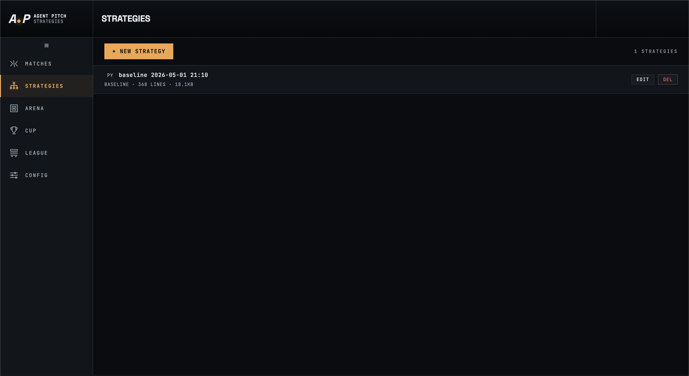
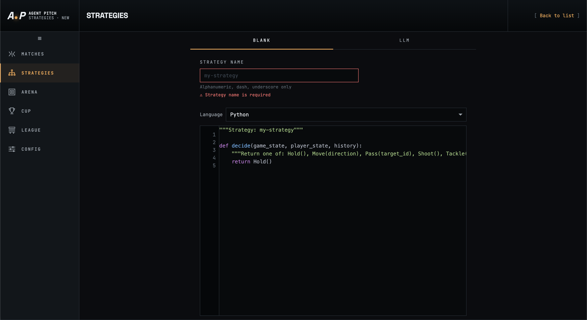
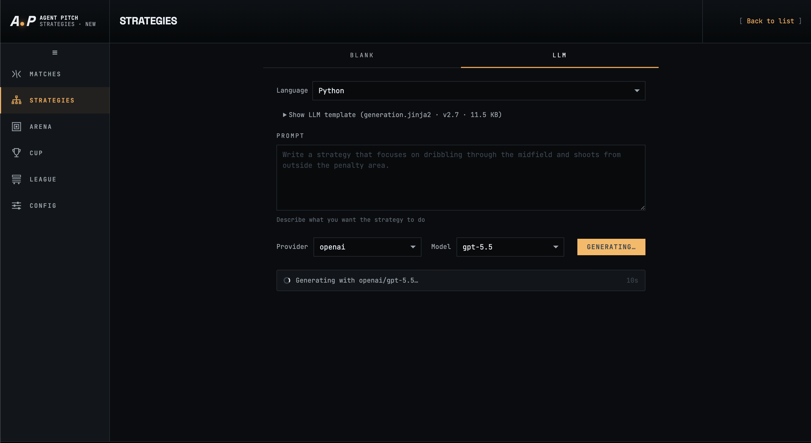

# Strategies

A **strategy** is a file containing a single `decide()` function that every player on one team calls each simulation tick to choose their next action. The Strategies section is where you author, generate, and manage these files.

Navigate to Strategies from the left sidebar.

---

## Strategy list



The list shows every strategy saved in your library (`data/strategies/`). Each row displays:

| Field | Description |
|-------|-------------|
| Language badge | `PY`, `JS`, or `RS` — the sandbox the strategy runs in. |
| Name | The unique identifier used to assign this strategy to a team when starting a match. |
| Timestamp | When the strategy file was last modified. |
| Tag | `BASELINE` for the initial hand-written default; LLM-generated strategies show the provider and model. |
| Size | Line count and file size. |

Click **Edit** to open the strategy in the editor, or **Del** to permanently remove it. Click **+ New Strategy** to create one.

---

## Creating a strategy

Clicking **+ New Strategy** opens the creation form with two tabs: **Blank** and **LLM**.

### Blank tab — write code manually



Use the Blank tab to write a strategy from scratch or paste in existing code.

1. Enter a **Strategy Name** — alphanumeric characters, dashes, and underscores only (e.g. `my-strategy`).
2. Choose a **Language**: Python, JavaScript, or Rust.
3. Write your `decide()` function in the editor. The editor pre-fills a minimal skeleton:

```python
"""Strategy: my-strategy"""

def decide(game_state, player_state, history):
    """Return one of: Hold(), Move(direction), Pass(target_id), Shoot(), Tackle(...)"""
    return Hold()
```

Click **Save** (or scroll down to find it) to write the file to `data/strategies/<name>.<ext>`.

### LLM tab — generate with an AI model



Use the LLM tab to ask a language model to write the strategy for you.

1. Choose a **Language** (Python, JavaScript, or Rust).
2. Write a **Prompt** describing the playing style you want — for example:
   > *Write a strategy that focuses on dribbling through the midfield and shoots from outside the penalty area.*
   Leave the prompt empty to let the model apply general best-practice tactics.
3. Select a **Provider** and **Model** from the dropdowns (populated from your LLM Config).
4. Click **Generating…** to start. A status bar shows the active provider and elapsed time.

The model uses the `generation.jinja2` prompt template (version and size shown under the language picker) which injects the full `decide()` API contract, field dimensions, and player attribute schema before your prompt. Once generation completes the strategy is saved automatically and you are returned to the list.

---

## The `decide()` contract

Every strategy, regardless of language, must export a function with this exact signature:

```python
def decide(game_state, player_state, history):
    ...
```

The engine calls it once per player per tick. The function must return one of the five `Action` subclasses listed below. Any other return type — or an unhandled exception — is silently substituted with `Hold()`.

### Parameters

#### `game_state` — shared match snapshot

A dict with the following structure:

| Key | Type | Description |
|-----|------|-------------|
| `tick` | `int` | Current simulation tick number. |
| `match_time_seconds` | `float` | Elapsed match time in seconds. |
| `half` | `int` | Current half (`1` or `2`). |
| `ticks_remaining` | `int` | Ticks left in the match. |
| `score` | `{"team_a": int, "team_b": int}` | Current score. |
| `ball.position` | `(float, float)` | Ball coordinates on the field. |
| `ball.possession` | `"team_a" \| "team_b" \| None` | Which team holds possession, or `None` for a loose ball. |
| `ball.carrier_id` | `str \| None` | Player ID of the ball carrier, e.g. `"team_a_2"`, or `None`. |
| `players` | `dict[str, PlayerRecord]` | All players keyed by ID (`"{team_id}_{index}"`). Each record has `team`, `role`, `position`, and `has_ball`. |
| `field.width` | `float` | Pitch width in game units. |
| `field.height` | `float` | Pitch height in game units. |
| `field.team_a_goal_x` | `float` | X coordinate of Team A's goal. |
| `field.team_b_goal_x` | `float` | X coordinate of Team B's goal. |
| `field.goal_top` | `float` | Y coordinate of the top of the goal mouth. |
| `field.goal_bottom` | `float` | Y coordinate of the bottom of the goal mouth. |
| `my_team` | `"team_a" \| "team_b"` | This player's team. |
| `my_player_id` | `str` | This player's own ID, e.g. `"team_a_0"`. |

#### `player_state` — this player's attributes

Contains the full attribute profile of the calling player: `speed`, `skill`, `strength`, `dribbling`, `passing`, `shooting`, `stamina`, `discipline`, `save` (GK only), `role`, `position`, `health`, `has_ball`, and `player_id`.

#### `history` — recent action log

A list of the player's own recent actions, ordered oldest-first. Useful for implementing memory-aware tactics or detecting repeated failed actions.

### Return values — the five actions

| Action | Arguments | Description |
|--------|-----------|-------------|
| `Hold()` | — | Stay in place. With the ball: braces against tackles. Without the ball: no-op. The universal fallback. |
| `Move(dx, dy, speed)` | `dx`, `dy`: direction vector; `speed`: `0.0`–`1.0` ratio | Move in the given direction. Only direction matters; the engine normalises the vector and scales by `player.speed × speed`. |
| `Pass(target_pos, power)` | `target_pos`: `(x, y)` field coordinate; `power`: `1`–`20` | Kick the ball toward a field position. Effective power is capped by `player.strength`. Accuracy degrades with low `player.passing` skill. |
| `Shoot(angle, power)` | `angle`: degrees from attack direction; `power`: `1`–`20` | Shoot at goal. `angle=0` aims straight at the centre. Angular error scales with low `player.shooting`. |
| `Tackle(target_player_id)` | `target_player_id`: opponent player ID string | Attempt to win the ball from an opponent within tackle range. Success depends on `player.strength` vs the opponent's; an invalid ID substitutes `Hold()`. |

### JavaScript and Rust strategies

For JavaScript (`.js`) and Rust (`.rs`) strategies the `decide()` function must return a tagged object / struct instead of a Python class instance:

```js
// JavaScript
function decide(game_state, player_state, history) {
    return { type: "Move", dx: 1.0, dy: 0.0, speed: 0.8 };
}
```

```rust
// Rust — compiled to WASM per match
pub fn decide(game_state: &str, player_state: &str, history: &str) -> String {
    r#"{"type":"Hold"}"#.to_string()
}
```

Valid `type` values: `"Hold"`, `"Move"`, `"Pass"`, `"Shoot"`, `"Tackle"`. Malformed returns fall back to `Hold()`.

---

## Strategy storage

Strategies are stored as plain files in `data/strategies/`:

```
data/strategies/
  baseline.py          # source code
  baseline.meta.json   # provenance sidecar (provider, model, timestamps)
```

The sidecar records who created the strategy (`"manual"` or `"llm"`), which provider and model were used, the original prompt, and token usage for LLM-generated strategies. It is written automatically — you do not need to manage it by hand.

During a match, evolved copies are archived under the match log directory (`data/logs/<match-id>/strategies/`) so the full generation history is preserved for review.
